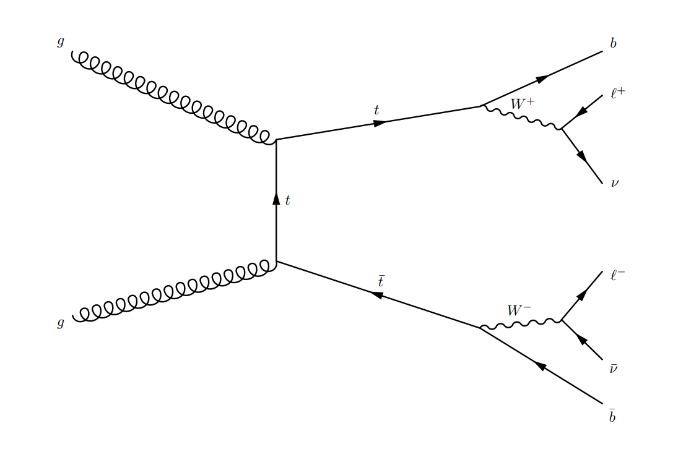

# ttbarNN
This repository contains a Python code that computes the invariant mass of $t\overline{t}$ events decaying dileptonically using a fully connected neural network with two hidden layers, each with 512 nodes.
The input features of the NN inlcude basic event information such as the $p_T$ of a reconstructed particle, as well as the solutions to the kinematic reconstructions.

